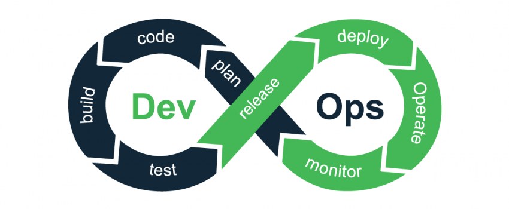
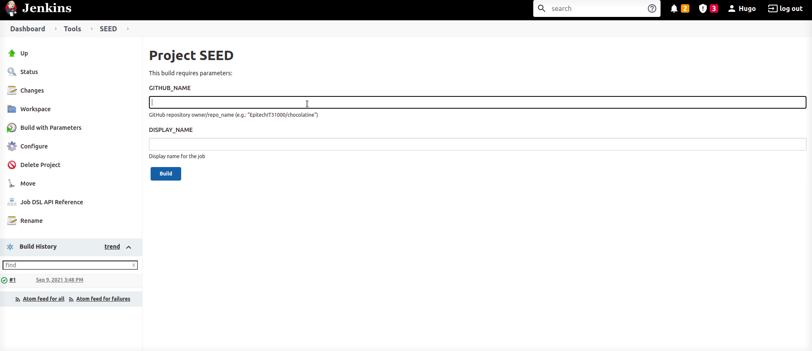

# My Marvin 🧪


### 💻 About the project

The purpose of the project is to master the art of automating your everyday developer tasks with Jenkins.

Initiation to automation with jenkins Initiation to Jenkins. Take a look to the .pdf files (folder **assets**) to try before look at the project solution.




### 🔋 How to run

``` docker-compose up ```

then go to :

``` http://localhost:8080/ ```

And now you can log with one of the user.

In the groovy file you can find different kind of jobs. These jobs allow for example to clone a repository.


### 👀 Visualisation

Example of creating a CI




---

Matisse Page
Epitech student